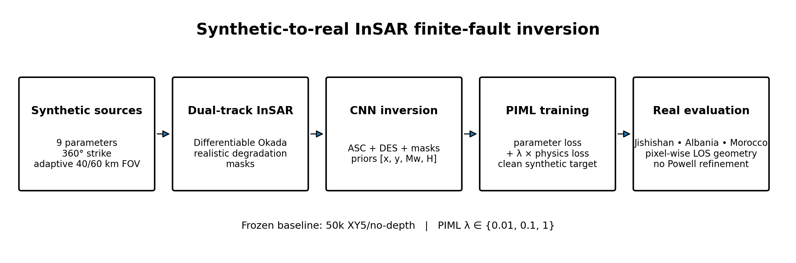
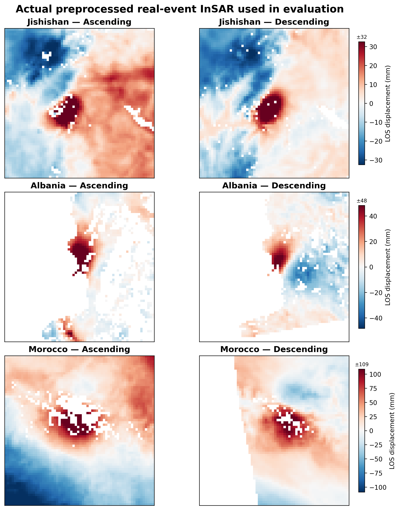
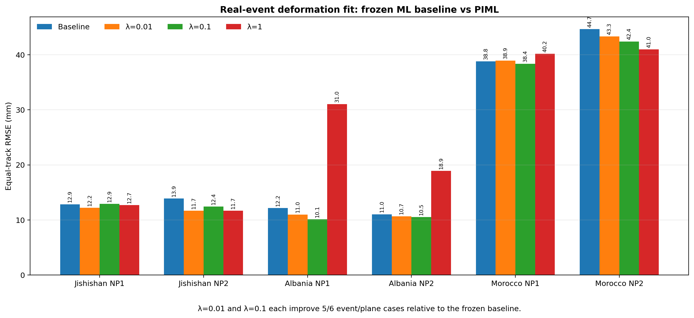
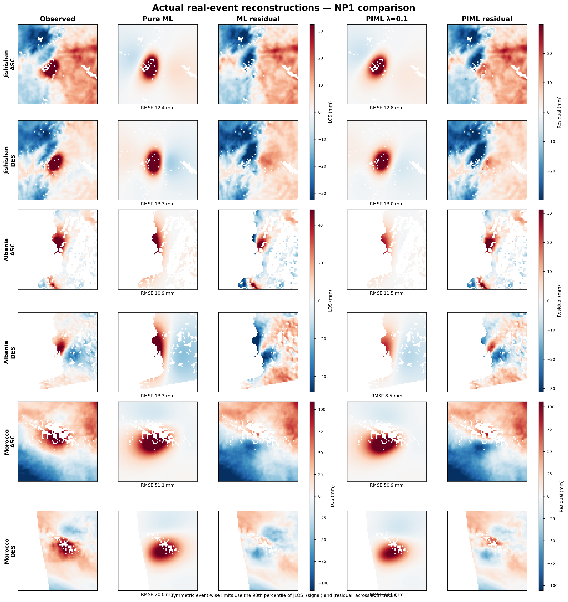
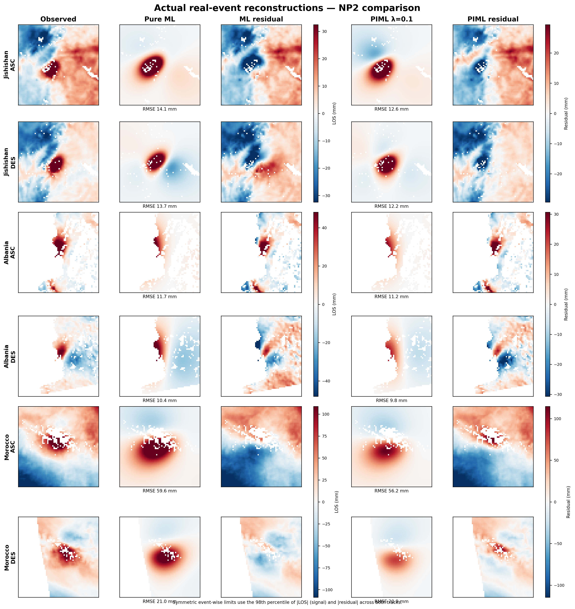

# Physics-Informed Deep Learning for Synthetic-to-Real InSAR Earthquake Source Inversion

A reproducible research project for **nine-parameter finite-fault earthquake source inversion** from dual-track InSAR and seismic priors. The project asks whether adding a differentiable Okada forward model during training improves transfer from realistic synthetic data to real earthquakes.

## Overview



**Figure 1.** Project workflow. Physics-based synthetic finite-fault sources are converted to dual-track InSAR with a differentiable Okada model, realistically degraded, and inverted by the frozen CNN baseline or PIML model. PIML adds deformation consistency against the paired clean synthetic target during training. Real-event evaluation uses physical grids and pixel-wise LOS geometry without Powell refinement.

## Method

The network maps dual-track InSAR plus seismic priors to source parameters:

`(ascending InSAR, descending InSAR, seismic priors) -> neural network -> source parameters`

For PIML training, the predicted source parameters are passed through the differentiable Okada model and compared with the paired clean synthetic deformation:

`L_total = L_theta + lambda_phys * L_phys`

Both terms backpropagate through the network. Real-event inference is direct neural-network inference; no Powell refinement is used for the primary comparison.

### Source parameters

The model predicts horizontal location, depth, slip, fault length, fault width, dip, strike, and rake. Strike is represented with a normalized sine/cosine pair to avoid the 0/360-degree discontinuity.

### Frozen baseline

The primary baseline uses **50,000 realistic synthetic training examples**. Event conditioning is `[x, y, Mw, H]`; seismic depth is deliberately withheld. The seismic x/y uncertainty is approximately 5 km. The 250k experiment is retained only as a scaling ablation and is not the primary baseline.

## Synthetic-to-real setup

Synthetic examples use a single finite rectangular dislocation, full 360-degree strike coverage, adaptive 40/60 km field of view, dual viewing geometries, noisy seismic priors, and realistic InSAR degradation.

The degradation model includes white noise, spatially correlated atmospheric noise, orbital ramp, bilinear distortion, decorrelation noise, and spatially correlated missing pixels. PIML physics supervision uses the paired **clean synthetic deformation**, not the degraded observation.

## Real case studies



**Figure 2.** Actual preprocessed ascending and descending LOS observations used for Jishishan (2023), Albania (2019), and Morocco (2023). Each event uses one symmetric color scale shared by its ASC/DES pair; scales differ across events because their displacement ranges differ substantially.

## Main results

### Held-out synthetic test set

| Model | Physics weight | Mean normalized error E | Median E | Best epoch |
|---|---:|---:|---:|---:|
| Pure ML baseline | 0 | 0.300736 | 0.264566 | 22 |
| PIML | 0.01 | 0.297952 | 0.260436 | 35 |
| PIML | 0.1 | 0.297597 | 0.265047 | 78 |
| PIML | 1 | 0.326558 | 0.308334 | 84 |

Moderate physics weights improve the aggregate synthetic metric by only about 1%. A strong physics weight (`lambda=1`) degrades synthetic parameter recovery.

### Real-event deformation fit

Equal-track RMSE in mm:

| Event | Plane | Baseline | lambda=0.01 | lambda=0.1 | lambda=1 |
|---|---|---:|---:|---:|---:|
| Jishishan | NP1 | 12.8610 | **12.2272** | 12.9222 | 12.7221 |
| Jishishan | NP2 | 13.9028 | **11.6717** | 12.4258 | 11.6811 |
| Albania | NP1 | 12.1636 | 10.9939 | **10.1207** | 31.0270 |
| Albania | NP2 | 11.0389 | 10.6824 | **10.5228** | 18.9315 |
| Morocco | NP1 | 38.8018 | 38.9472 | **38.3836** | 40.1938 |
| Morocco | NP2 | 44.6525 | 43.3237 | 42.4281 | **40.9934** |

`lambda=0.01` and `lambda=0.1` each improve **5 of 6** event/plane cases relative to the frozen pure-ML baseline. No single physics weight is selected retrospectively using the real-event test cases.

The central result is therefore deliberately modest: adding differentiable Okada consistency produces only a small synthetic improvement for moderate weights, while producing larger deformation-fit improvements in several real cases. Strong physics regularization is not uniformly beneficial.

## Quantitative real-event comparison



**Figure 3.** Equal-track deformation RMSE for the frozen 50k pure-ML baseline and PIML physics weights. Moderate weights `lambda=0.01` and `lambda=0.1` each improve 5 of 6 event/plane cases relative to the baseline; `lambda=1` is strongly event dependent.

## Repository

```text
insar-piml/
|-- configs/
|   `-- experiment.json
|-- data/
|   |-- README.md
|   |-- real/
|   `-- synthetic/
|-- experiments/
|   `-- README.md
|-- physics/
|   `-- okada.py
|-- results/
|   |-- README.md
|   |-- figures/
|   `-- summary/
|       |-- synthetic_metrics.csv
|       |-- real_event_metrics.csv
|       `-- real_baseline.csv
|-- src/
|   |-- data/
|   |   |-- generate_synthetic.py
|   |   `-- add_realistic_noise.py
|   |-- train_baseline.py
|   |-- train_piml.py
|   `-- evaluate_real.py
`-- verify_repository.py
```

## Data

Large generated arrays, real-event rasters, and trained checkpoints are intentionally not committed to Git. See [`data/README.md`](data/README.md) for the expected workflow and provenance requirements.

The clean synthetic generator is in `src/data/generate_synthetic.py`; realistic degradation is in `src/data/add_realistic_noise.py`.

## Reproducibility

The clean repository contains the exact frozen training scripts and differentiable Okada implementation used for the reported pipeline. The real-event evaluator uses each event's physical `X_km`, `Y_km`, and pixel-wise LOS geometry.

If the original research archive and frozen baseline checkpoint are available at their documented local paths, run:

```bash
python verify_repository.py
```

The expected equal-track baseline RMSEs are:

```text
Jishishan NP1  12.8610 mm
Jishishan NP2  13.9028 mm
Albania   NP1  12.1636 mm
Albania   NP2  11.0389 mm
Morocco   NP1  38.8018 mm
Morocco   NP2  44.6525 mm
```

The verification script requires all six values to reproduce within tolerance.

## Important comparison caveat

The frozen pure-ML baseline uses validation parameter loss for scheduling/checkpointing, while the PIML sweep uses total validation loss. This difference is disclosed rather than hidden and should be considered when interpreting small synthetic differences.

## Supporting experiments

The project also explored 250k synthetic scaling, alternative seismic priors, event-local training, multiscale/scale augmentation, nuisance/ramp prediction, and robust detrending. These are supporting diagnostics or negative results rather than the primary comparison. See [`experiments/README.md`](experiments/README.md).

## Limitations

- Real events do not provide exact nine-parameter source ground truth, so real evaluation is based on InSAR deformation fit rather than claimed parameter accuracy.
- Three earthquakes and two nodal planes per event are a useful transfer test but not a universal benchmark.
- Moderate physics weighting helps several real cases but does not establish that PIML always outperforms pure ML.
- Real InSAR preprocessing and redistribution depend on the provenance/licensing of the source products.

## Research takeaway

**Differentiable physics is most useful here as a moderate training regularizer rather than a dominant objective:** the synthetic metric changes little, but moderate physics weights improve most real event/plane deformation fits, while excessive physics weighting can hurt.

### Pure ML vs PIML real-event reconstructions

The following qualitative comparison uses the frozen 50k pure-ML baseline and a representative moderate PIML model ($\lambda_{\mathrm{phys}}=0.1$). Both nodal planes are shown to avoid post-hoc focal-plane selection. Columns compare observed LOS deformation, model prediction, and residual for ascending and descending tracks. The $\lambda=0.1$ model is shown as a representative moderate physics weight; it was not selected retrospectively as a universal real-event optimum.

**Nodal plane 1 (NP1)**



**Nodal plane 2 (NP2)**



## License

The software is released under the MIT License. Preprocessed real-event InSAR
products remain subject to applicable upstream data-provider terms; see
`data/README.md`.

**Random seed:** seed 42 is used for the primary reported experiments.
